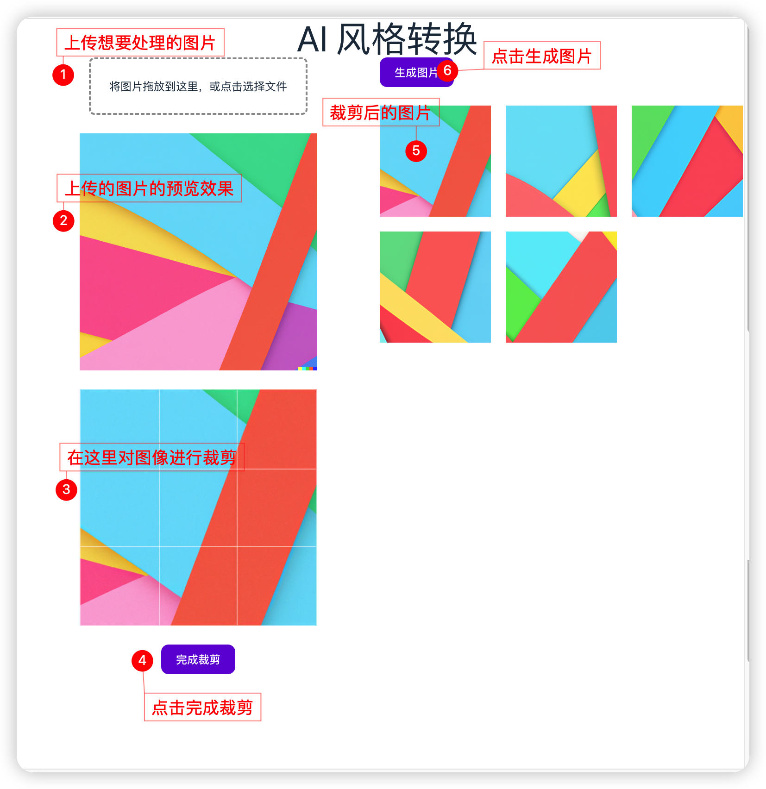

# StyleArtist

Transform your images into different styles with ease.

## Description

StyleArtist is a Chrome extension that allows users to quickly and easily transform their images into different styles. With a simple right-click on an image, users can choose from a variety of preset styles, including oil painting, watercolor, pencil sketch, and more. The extension uses advanced AI algorithms to analyze and apply artistic styles to images, creating stunning visual effects that are sure to impress.

## Installation

1. Go to the Chrome Web Store: https://chrome.google.com/webstore/category/extensions
2. Search for "StyleArtist" in the search bar.
3. Click "Add to Chrome" to install the extension.

## Usage

1. Upload your image.
2. Cut out it.
3. Click generate.
4. Enjoy your newly styled image!

## Features

- Easy installation and setup
- Variety of preset styles to choose from(TODO)
- Advanced AI algorithms for high-quality results
- Fast and efficient image processing

## Support

If you have any questions or issues with the StyleArtist extension, please contact us at issues.

## License

This project is licensed under the [MIT License](https://opensource.org/licenses/MIT).

## 怎么使用

!!! 注意，生成的图片过段时间就失效了，对于喜欢的图像请及时保存

#### 如果大家对自建 Stable Diffusion 感兴趣，可以考虑考虑 runpod

https://runpod.io?ref=ici4f6zc
